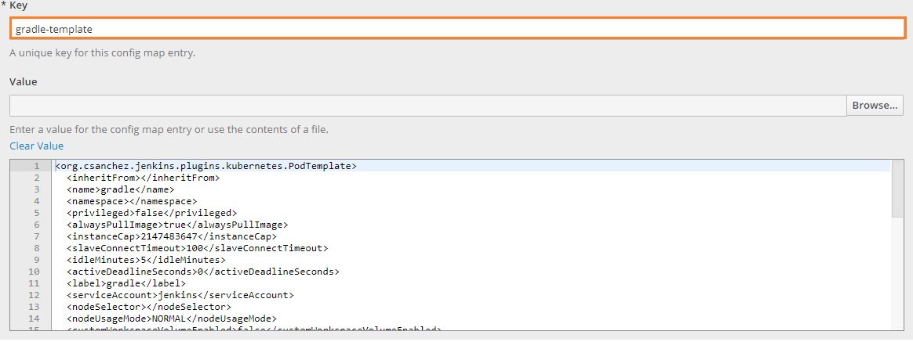

# Docker image for Jenkins Gradle agent
## Building the image from source

* Make appropriate changes in Dockerfile (e.g. update build tool version or package versions)
* Build the docker image from current project directory using the following command:
    ```bash
    docker build . -t edp-jenkins-gradle-agent:latest
    ```
* Push the newly created Docker image in your public or private Docker image hub
    ```bash
    docker push examplehub/edp-jenkins-gradle-agent:latest
    ```

## Adding base image as a Jenkins Slave

Follow the steps below to add a new Jenkins slave:

* Open the existing or add a new template for Jenkins Slave by navigating to the jenkins-slaves config map under the EDP namespace. Fill in the Key field and add a value:

    

* Specify image and tag in ***jenkins-slaves*** config map
    ```xml
    <containers>
      <org.csanchez.jenkins.plugins.kubernetes.ContainerTemplate>
        <image>examplehub/edp-jenkins-gradle-agent:latest</image>
      </org.csanchez.jenkins.plugins.kubernetes.ContainerTemplate>
    <containers>
    ```
  **Note:** Alternatively, you can change the image in Jenkins Kubernetes Pod Template settings. Navigate to the ***Container Template*** and replace your image in ***Docker image*** field.  

* As a result, the Jenkins slave will be run with newly re-built image.
